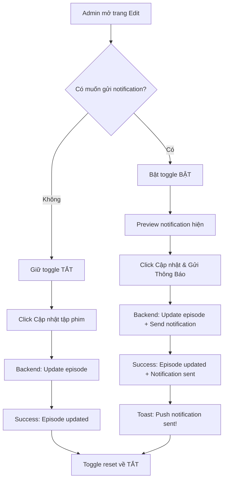

# 🔔 Admin Panel - Push Notification Feature

## 📋 Tổng quan

Admin có thể **TỰ QUYẾT ĐỊNH** gửi push notification khi chỉnh sửa episode, thay vì tự động gửi cho mọi tập phim.

### ✨ Tính năng mới:

- ✅ **Toggle switch** để BẬT/TẮT gửi notification
- ✅ **Preview notification** trước khi gửi
- ✅ **Visual feedback** - Button đổi màu khi bật notification
- ✅ **Toast notification** xác nhận đã gửi thành công
- ✅ **Auto-reset** - Toggle tự tắt sau khi gửi

---

## 🎨 Giao diện

### Khi TẮT notification (mặc định):
```
┌─────────────────────────────────────────┐
│  🔔 Gửi Push Notification              │
│  Thông báo đến mobile app...     [TẮT] │
└─────────────────────────────────────────┘

[Cập nhật tập phim]  ← Button màu xanh thường
```

### Khi BẬT notification:
```
┌─────────────────────────────────────────┐
│  🔔 Gửi Push Notification              │
│  Thông báo đến mobile app...     [BẬT] │
├─────────────────────────────────────────┤
│ ℹ️ Notification sẽ được gửi             │
│                                         │
│ Title: Tập 15 mới đã ra! 🎬           │
│ Body: Hoàn Mỹ Thế Giới - Tập 15       │
│      vừa được cập nhật                  │
│ Gửi đến: Tất cả thiết bị active        │
└─────────────────────────────────────────┘

[🔔 Cập nhật & Gửi Thông Báo]  ← Button gradient tím
```

---

## 🚀 Cách sử dụng

### 1️⃣ Truy cập trang Edit Episode

```
Admin Panel → Products → Chọn episode cần edit
```

### 2️⃣ Chỉnh sửa thông tin episode

Sửa các thông tin cần thiết:
- Tên tập phim
- Video links
- Thumbnail
- v.v.

### 3️⃣ Quyết định gửi notification

**Option A: KHÔNG gửi notification (mặc định)**
- Giữ nguyên toggle ở trạng thái TẮT
- Click "Cập nhật tập phim"
- ✅ Episode được cập nhật
- ❌ KHÔNG gửi notification

**Option B: GửI notification**
- Bật toggle sang BẬT
- Xem preview notification (Title, Body, Target)
- Click "🔔 Cập nhật & Gửi Thông Báo"
- ✅ Episode được cập nhật
- ✅ Notification gửi đến tất cả devices
- 🎉 Toast hiện: "🔔 Push notification đã được gửi đến users!"

### 4️⃣ Sau khi submit thành công

- Toggle **tự động reset về TẮT**
- Lần edit tiếp theo, phải bật lại nếu muốn gửi
- Tránh gửi spam notification không cần thiết

---

## 📊 Flow hoạt động



---

## 🔧 Technical Details

### Frontend (React)

**File:** `React-redux/src/page/Admin/product/component/edit.tsx`

**State:**
```typescript
const [sendNotification, setSendNotification] = useState(false);
```

**Form Data:**
```typescript
formdata.append("sendPushNotification", sendNotification ? "true" : "false");
```

**UI Components:**
- `<Switch>` - Toggle BẬT/TẮT
- `<Alert>` - Preview notification
- `<Button>` - Dynamic text & style

---

### Backend (Node.js)

**File:** `node/src/controller/products.ts`

**Nhận flag từ request:**
```typescript
const { sendPushNotification } = req.body;
const shouldSendNotification = sendPushNotification === "true" || sendPushNotification === true;
```

**Logic gửi notification:**
```typescript
if (shouldSendNotification && data.category && data.seri) {
  const categoryInfo = await Category.findById(data.category).select('name slug');
  if (categoryInfo) {
    const episodeNumber = parseInt(data.seri);
    if (episodeNumber > 1) {
      console.log(`📤 Sending push notification for ${categoryInfo.name} - Tập ${episodeNumber}`);
      notifyNewEpisode(categoryInfo.name, episodeNumber, categoryInfo.slug)
        .catch(err => console.error('❌ Failed to send push notification:', err));
    }
  }
} else if (!shouldSendNotification) {
  console.log('ℹ️ Push notification skipped (admin disabled)');
}
```

---

## 📝 Backend Logs

### Khi KHÔNG gửi notification:
```
ℹ️ Push notification skipped (admin disabled)
```

### Khi gửi notification:
```
📤 Sending push notification for Hoàn Mỹ Thế Giới - Tập 15
✅ Push notification sent: { success: true, data: {...} }
```

### Khi skip vì là tập 1:
```
⚠️ Skip notification: Episode 1 is first episode
```

---

## ⚠️ Lưu ý quan trọng

### 1. **Toggle auto-reset**
- Mỗi lần submit thành công, toggle sẽ tự động TẮT
- Phải BẬT lại cho lần edit tiếp theo
- Tránh spam notification không cần thiết

### 2. **Chỉ gửi cho episode > 1**
- Tập 1 (episode đầu tiên) sẽ KHÔNG gửi notification
- Logic: Tập đầu không cần thông báo "tập mới"
- Từ tập 2 trở đi mới gửi

### 3. **Notification content**
- **Title:** "Tập {số tập} mới đã ra! 🎬"
- **Body:** "{Tên phim} - Tập {số tập} vừa được cập nhật"
- **Data:** `{ type: "new_episode", categorySlug, episode }`

### 4. **Target audience**
- Gửi đến **TẤT CẢ** thiết bị có push token active
- Không thể chọn gửi cho user cụ thể (feature này trong Edit)

---

## 🎯 Use Cases

### ✅ KHI NÊN gửi notification:

1. **Update episode quan trọng**
   - Episode cuối season
   - Episode đặc biệt
   - Episode được chờ đợi

2. **Fix lỗi nghiêm trọng**
   - Video bị lỗi → Fix xong → Thông báo users
   - Sub sai → Sửa xong → Thông báo

3. **Thêm server mới**
   - Upload video quality cao hơn
   - Thêm server backup

### ❌ KHI KHÔNG NÊN gửi:

1. **Chỉnh sửa nhỏ**
   - Sửa typo trong metadata
   - Update view count
   - Thay đổi không quan trọng

2. **Testing/Development**
   - Test video links
   - Thử nghiệm tính năng

3. **Bulk update**
   - Update hàng loạt episodes
   - → Chỉ gửi cho episode đầu/cuối

---

## 🔍 Troubleshooting

### Toggle không hoạt động?
```javascript
// Check console logs
console.log('sendNotification:', sendNotification);
```

### Backend không nhận flag?
```bash
# Check backend logs
📤 Sending push notification... # ← Phải thấy log này
```

### Notification không gửi được?
1. Check push tokens có active không
2. Check SECRET_KEY trong .env
3. Check backend logs để thấy errors

### Preview không hiện?
```javascript
// Check state category
console.log('state.category:', state?.category);
console.log('form seri:', form.getFieldValue('seri'));
```

---

## 📈 Statistics & Monitoring

### Track notification sends:
```javascript
// Backend logs tự động track
📤 Sending push notification for {name} - Tập {episode}
✅ Push notification sent: {...}
```

### Monitor via Admin API:
```bash
# Get total notifications sent today
GET /api/push-tokens?page=1

# Response shows active devices count
```

---

## 🎨 UI/UX Features

### 1. **Visual Feedback**
- Card đổi màu khi bật (blue background)
- Border highlight
- Smooth transition

### 2. **Button States**
- Normal: "Cập nhật tập phim"
- Active: "🔔 Cập nhật & Gửi Thông Báo"
- Loading: Spinner + disabled
- Gradient purple khi active

### 3. **Toast Notifications**
- Success: "Cập nhật {name} thành công"
- Info (khi gửi): "🔔 Push notification đã được gửi đến users!"
- Error: "Cập nhật thất bại"

### 4. **Preview Alert**
- Type: info
- Icon: BellOutlined
- Shows exact notification content
- Helps admin verify before sending

---

## 🚦 Best Practices

### 1. **Be selective**
- Chỉ gửi notification khi THỰC SỰ cần
- Không spam users
- Quality > Quantity

### 2. **Verify before send**
- Check preview carefully
- Make sure episode number is correct
- Verify phim name

### 3. **Timing**
- Gửi vào giờ cao điểm (8PM - 10PM)
- Tránh gửi quá muộn (sau 11PM)
- Tránh gửi quá sớm (trước 8AM)

### 4. **Consistency**
- Gửi đều đặn cho các episode quan trọng
- Users sẽ quen với pattern

---

## 📚 Related Documentation

- **Push Notification Guide:** `docs/PushNotificationGuide.md`
- **Send Without Login:** `docs/SendNotificationWithoutLogin.md`
- **Quick Start:** `README_PUSH_NOTIFICATION.md`

---

**Made with ❤️ - Admin now has full control over push notifications!**

